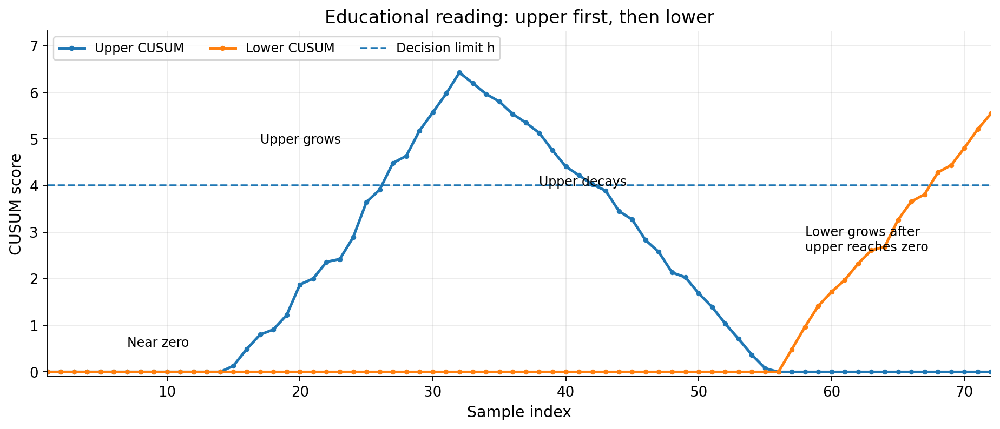
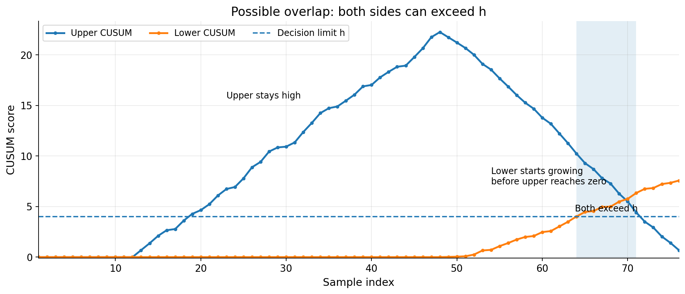
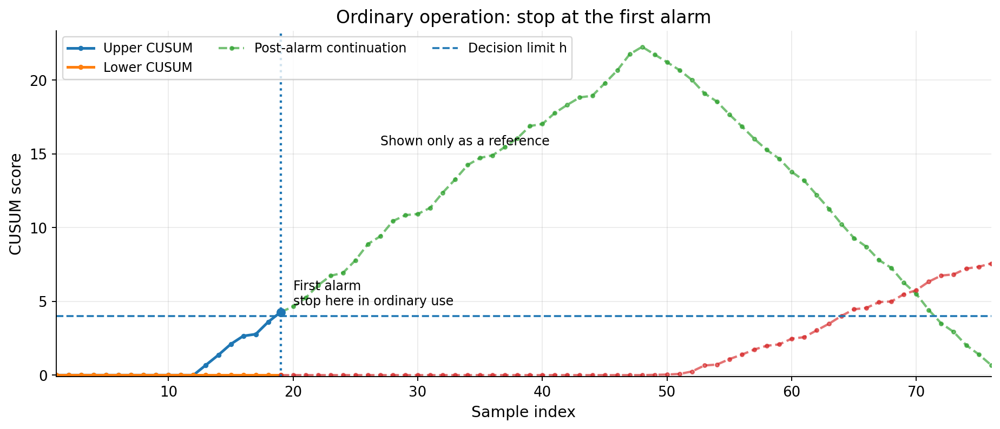

# CUSUM 入門資料（図入り・社内教育用 改訂版 v7）

## 1. はじめに なぜ CUSUM を学ぶのか

現場では、1点だけ見ると正常に見えるのに、少し高い状態や少し低い状態がじわじわ続くことがあります。  
単純なしきい値監視は、大きな飛び出しには強いですが、このような**小さいずれの積み重なり**は見逃しやすいです。  
CUSUM は、その「小さいずれが続くこと」を証拠として累積するので、平均のゆっくりした変化を見つけやすい方法です。

NIST でも、CUSUM は平均の小さな変化を見つけるのに有効で、とくに 2σ 以下のずれでは Shewhart 管理図より有利と説明されています。  
MathWorks の `cusum` も、平均の小さい変化を検出する関数として整理されています。

---

## 2. この資料の目的

この資料では、次の5点が初学者でも分かるように整理します。

- 上側 CUSUM と下側 CUSUM が何を見ているか
- 教育用の図をどう読めばよいか
- 実際にはどのような重なり方があり得るか
- 通常運用ではどう読むか
- `k` をどう決めるか

---

## 3. CUSUM をひとことで言うと

CUSUM は、**実際の値そのものではなく、基準からどれだけずれたかを毎回スコア化して、それを足し上げる方法**です。

基本の累積和は次です。

```math
S_m = \sum_{i=1}^m (x_i - \mu_0)
```

- `x_i` は i 回目の値
- `μ0` は正常時の基準平均

同じ向きのずれが続くと、累積和が大きくなります。

---

## 4. なぜ上側・下側に分けるのか

ふつうの累積和では、上へのずれと下へのずれが打ち消し合うことがあります。  
そのため実務では、次の2つに分けて考えることがよくあります。

- **上側 CUSUM**: 値が高い方向の異常をためる
- **下側 CUSUM**: 値が低い方向の異常をためる

表形式 CUSUM は次です。

```math
S_{hi}(i) = \max\{0,\; S_{hi}(i-1) + x_i - \mu_0 - k\}
```

```math
S_{lo}(i) = \max\{0,\; S_{lo}(i-1) + \mu_0 - k - x_i\}
```

ここで `max(0, …)` があるため、値は 0 未満になりません。  
つまり、異常の証拠が弱まったら 0 に戻ります。

---

## 5. 図1 教育用の順番図



この図は、**教育用に読みやすくした例**です。  
順番は次のように置いています。

1. 上側 CUSUM が増える
2. 上側 CUSUM が徐々に減る
3. 上側 CUSUM が 0 になる
4. その後で下側 CUSUM が増える

### 図1の解釈

| 図の区間 | グラフの見え方 | 何を意味するか | 読み方のポイント |
|---|---|---|---|
| 前半 | 上側も下側もほぼ 0 | 明確な偏りがまだない | 正常に近い状態 |
| 上昇区間 | 上側だけ増える | 高い方向のずれが続いている | 上向き異常の証拠がたまる |
| 中間区間 | 上側が徐々に減る | 高い方向のずれが弱まった | 上向きの疑いが薄れている |
| 後半 | 上側が 0 のまま、下側が増える | 低い方向のずれが続いている | 下向き異常の証拠がたまる |

### 重要な注意

この図は**教育用に順番を分けた図**です。  
実際の式では、下側が増え始める前に必ず上側が 0 になるとは限りません。

---

## 6. 図2 実際にあり得る重なり方



この図では、まず高い値が続いて上側 CUSUM が大きくなります。  
そのあと低い値が続くと、

- 上側 CUSUM は減少する
- 下側 CUSUM は増加する

という動きが同時に起きます。  
そのため、**上側 CUSUM がまだしきい値 `h` を超えているのに、下側 CUSUM もしきい値 `h` を超える**ことが数式上はあり得ます。

### 図2の解釈

| 見る場所 | グラフの見え方 | 意味 |
|---|---|---|
| 前半 | 上側だけ大きく増える | 高い方向のずれが連続している |
| 中盤 | 上側はまだ高いが、少しずつ下がる | 高い方向の証拠が残っている |
| 後半 | 下側が上がり始める | 今度は低い方向のずれが続いている |
| 網掛け部分 | 上側も下側も `h` より上 | 2つは独立に更新されるため、数式上あり得る |

---

## 7. 図3 通常運用での見方



この図は、**通常運用での読み方**を表しています。  
実務では、NIST の表形式 CUSUMでも「どちらかが `h` を超えたら管理外」とみなします。  
MathWorks の `cusum` でも、上側と下側のしきい値超え位置 `iupper`, `ilower` を返します。

したがって、多くの運用では**最初のしきい値超えで警報**とし、その時点で異常検知として扱います。  
そのため、図2のように両側がしきい値を超えるまで長く追いかけないことが多いです。

今回の図では、グラフ内の文字は英語に統一しています。

### 図3の解釈

| 見る場所 | グラフの見え方 | 意味 |
|---|---|---|
| 警報前 | 上側または下側が成長する | 異常の証拠がたまっている |
| 最初の警報点 | どちらかが `h` を初めて超える | ここで異常検知として扱う |
| 点線部分 | 参考として描いた続き | 数式上は続けて計算できるが、通常運用ではここより前で止めることが多い |

---

## 8. 増減の意味を最小限で整理

### 8.1 上側 CUSUM

上側では、基準線は `μ0 + k` です。

| 今回の値 `x_i` | 上側 CUSUM の動き | 意味 |
|---|---|---|
| `x_i > μ0 + k` | 増える | 十分に高いので、上向き異常の証拠がたまる |
| `x_i = μ0 + k` | ほぼ変わらない | ちょうど境目 |
| `x_i < μ0 + k` | 減る | 上向き異常の証拠としては弱い |
| 減り続けて合計が負になりそう | 0 に戻る | 上向き証拠をいったん捨てる |

### 8.2 下側 CUSUM

下側では、基準線は `μ0 - k` です。

| 今回の値 `x_i` | 下側 CUSUM の動き | 意味 |
|---|---|---|
| `x_i < μ0 - k` | 増える | 十分に低いので、下向き異常の証拠がたまる |
| `x_i = μ0 - k` | ほぼ変わらない | ちょうど境目 |
| `x_i > μ0 - k` | 減る | 下向き異常の証拠としては弱い |
| 減り続けて合計が負になりそう | 0 に戻る | 下向き証拠をいったん捨てる |

---

## 9. `max(0, …)` の意味

`max(0, …)` は、**証拠が消えたら 0 に戻す**ためにあります。  
そのため、上側 CUSUM は高い方向だけを見やすくなり、下側 CUSUM は低い方向だけを見やすくなります。

---

## 10. `k` は何か

`k` は、**どのくらいのずれから本格的に反応するかを決める幅**です。

- `k` が小さい  
  → 少しのずれでも反応しやすい
- `k` が大きい  
  → 小さいずれは無視しやすい

上側では `μ0 + k`、下側では `μ0 - k` が反応の境目です。

---

## 11. `k` の算出方法

`k` は次で与えます。

```math
k = \frac{\delta \sigma}{2}
```

| 記号 | 意味 | どう決めるか |
|---|---|---|
| `μ0` | 正常時の平均 | 正常データから計算する |
| `σ` | 正常時の標準偏差 | 正常データから計算する |
| `δ` | 検知したい平均ずれの大きさ（何σか） | 設計者が決める |
| `k` | 反応し始める境目の半幅 | `k = δσ / 2` で計算する |

### 11.1 `σ` はどう求めるか

`σ` は、**CUSUM に入れる量の正常時のばらつき**です。

- 生データ `x_i` をそのまま監視するなら  
  → 正常データの標準偏差を使う
- 群平均や移動平均を監視するなら  
  → その平均系列の標準偏差を使う

### 11.2 `δ` はどう決めるか

`δ` は、**何σぶんの平均ずれを検知したいか**です。  
これはデータから自動で決まる値ではなく、設計者が決めます。

例:

- `δ = 0.5`  
  → かなり小さいずれにも敏感にしたい
- `δ = 1`  
  → 1σ 程度の平均ずれを拾いたい
- `δ = 2`  
  → 小さいずれは無視して、より大きい変化を見たい

### 11.3 なぜ 1/2 が付くのか

`k = δσ / 2` の意味は、**正常平均と、検知したい異常平均のちょうど真ん中を境目にする**ことです。

たとえば、検知したい上向き平均が `μ0 + δσ` なら、その真ん中は

```math
\mu_0 + \frac{\delta \sigma}{2}
```

です。  
そのため、上側 CUSUM はこの真ん中より上の値が続くと増えやすくなります。

---

## 12. 実務で最初に置く設定例

最初は次の置き方で始めると分かりやすいです。

```text
μ0 = 正常データの平均
σ  = 正常データの標準偏差
δ  = 1
k  = σ / 2
h  = 4 〜 5 σ単位 または 原単位で設計
```

NIST では `k` を検知したいずれの半分に、`h` を 4 または 5 程度に置く経験則を示しています。  
MathWorks の既定でも、最小検知ずれは 1 標準偏差、管理限界は 5 標準偏差です。

---

## 13. まとめ

- CUSUM は、基準からのずれを毎回スコア化して累積する方法
- 上側は高い方向、下側は低い方向の証拠をためる
- 教育用の図では順番を分けると理解しやすい
- ただし数式上は、上側が高いまま下側も育つことがあり得る
- 通常運用では、最初のしきい値超えで警報にすることが多い
- `k` は `δσ/2` で決め、`δ` は設計者が決める

---

## 14. 参考資料

- NIST/SEMATECH e-Handbook of Statistical Methods, CUSUM Control Charts  
  https://www.itl.nist.gov/div898/handbook/pmc/section3/pmc323.htm
- MathWorks `cusum` documentation  
  https://jp.mathworks.com/help/signal/ref/cusum.html
