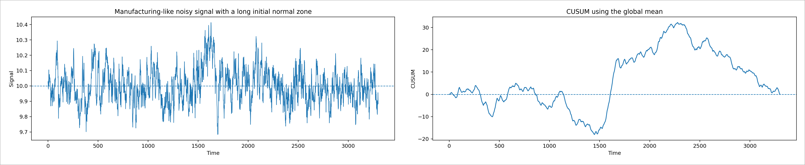
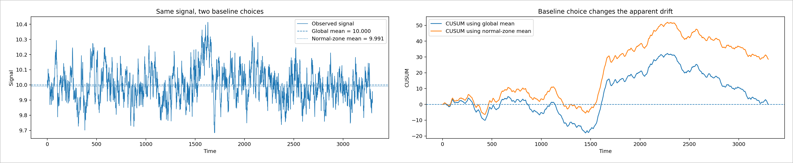
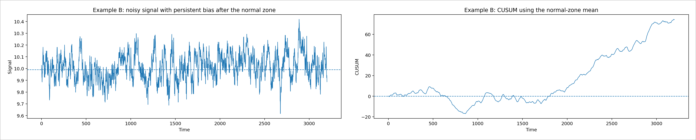
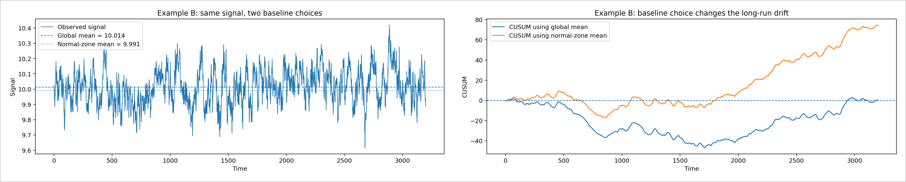

# 製造現場の時系列データをどう見るか
## 生波形では見えにくい小さな変化を CUSUM でつかむ入門資料

対象読者は、新入社員、配属直後の生産技術担当、設備保全担当、品質管理担当です。  
この資料の目的は、製造現場の時系列データに対して、

- 生波形だけでは何が分かりにくいのか
- CUSUM とは何か
- 基準平均はどう決めるべきか
- 全体平均と正常区間平均の違いは何か
- 実務では何をセットで見ればよいか

を、図と具体例で理解することです。

---

## 1. まず現場の状況を想像する

製造現場では、次のような信号を時間順に記録して監視することが多いです。

- ポンプ流量
- 吐出圧
- モータ電流
- ヒータ温度
- 真空圧
- 軸受の振動指標

こうした信号は、正常でもある程度は上下します。  
そのため、現場でよく起こるのが次の状況です。

**波形は揺れている。だが、本当に異常が始まっているのかは、生波形だけでは言い切れない。**

ここで最初に立てる問いは、これです。

> この生波形だけを見て、設備の状態が少しずつ悪い方向へ寄っていると判断できるか。

この問いから始めるのが、現場では自然です。

---

## 2. 生波形だけでは見えにくい例

次の図は、長い正常区間のあとで、小さな偏りが生じるように作った説明用データです。  
左が生波形、右が全体平均を基準にした CUSUM です。

左の生波形だけを見ると、ノイズやゆっくりした運転変動が重なっていて、

- 平均が本当にずれたのか
- 単なる揺れなのか

が分かりにくいです。

一方、右の CUSUM を見ると、

- 前半は大きくは流れない
- 途中から上向きにたまる
- その後に下向きの区間もある

というように、**小さな偏りが続いた区間**が読みやすくなります。

ここで伝えたいことは一つです。

**生波形では見えにくい継続偏りが、CUSUM では傾きとして見える。**

---

## 3. では、CUSUM とは何か

CUSUM は cumulative sum の略で、日本語では累積和と呼ばれます。  
考え方は単純です。

**基準より上なら少し足す。基準より下なら少し引く。**

これを時刻順に続けていきます。

基本式は次です。

$$

S_t = \sum_{i=1}^{t}(x_i - \mu)

$$

ここで、

- $x_i$：時刻 $i$ の測定値
- $\mu$：基準平均
- $S_t$：時刻 $t$ までの累積和

です。

この式でいちばん大事なのは、次の関係です。

$$

S_t - S_{t-1} = x_t - \mu

$$

これは、**CUSUM の傾きが、その時点の値と基準平均との差そのもの**だという意味です。

つまり、

- 値が基準より上なら、CUSUM は上向き
- 値が基準より下なら、CUSUM は下向き
- 値が基準付近なら、CUSUM は横ばい

と読めます。

---

## 4. 5点だけの数値例で理解する

式だけでは分かりにくいので、まず 5 点だけで見ます。

基準平均を 10.00 とします。  
新しいデータが次だったとします。

$$

10.02,\ 10.04,\ 9.99,\ 10.03,\ 10.02

$$

平均との差は、

$$

0.02,\ 0.04,\ -0.01,\ 0.03,\ 0.02

$$

です。

これを順に足すと、CUSUM は

$$

0.02,\ 0.06,\ 0.05,\ 0.08,\ 0.10

$$

になります。

生波形だけを見ると、全部 10 前後で、普通の揺れに見えます。  
しかし、CUSUM では少しずつ上向きにたまっていきます。

これは、**1点ずつは小さくても、同じ向きの偏りが続いている**ことを意味します。

現場の言葉に置き換えると、次のような状況です。

- 圧力が毎回ほんの少し高め
- 電流が毎回ほんの少し重め
- 温度が毎回ほんの少し上振れ

1回だけなら気にならなくても、続くと意味が変わります。

---

## 5. なぜ製造現場で役に立つのか

CUSUM が役に立つのは、設備の悪化がいきなり大異常になるとは限らないからです。

現場では、むしろ次のような変化が多いです。

- バルブやノズルの状態が少しずつ変わる
- センサの零点がじわじわずれる
- 負荷が少しずつ重くなる
- 温調が少しずつ甘くなる
- 摩耗によって平均値がわずかに寄る

こういうとき、生波形の瞬間値はノイズに埋もれます。  
しかし、同じ向きの偏りが続けば、CUSUM では傾きとして現れます。

社内で一言で説明するなら、

**CUSUM は「一瞬の高さ」を見るのではなく、「偏りが続いているか」を見る道具**

です。

---

## 6. ここで出る疑問：その平均はどれを使うのか

CUSUM では $x_i - \mu$ を足します。  
すると必ず次の疑問が出ます。

> その平均 $\mu$ は何を使うのか。

ここでは、

- 全体平均
- 正常区間平均

の 2 つを分けて考えることが重要です。

### 6.1 全体平均

全体平均は、

$$

\bar{x}_{\mathrm{all}} = \frac{1}{T}\sum_{t=1}^{T}x_t

$$

です。

これは、**この記録全体の中心がどこか**を見るには自然です。  
異常があるか分からない段階で、まず全体平均を引いて全体像を見るのは合理的です。

### 6.2 正常区間平均

正常区間平均は、

$$

\mu_0 = \frac{1}{K}\sum_{t \in \text{normal zone}}x_t

$$

です。

これは、**変化前の代表値**です。  
監視の基準としてはこちらが本命です。

この 2 つは競合ではなく、役割が違います。

**全体平均は「見るための基準」、正常区間平均は「検出するための基準」**

と覚えると整理しやすいです。

---

## 7. 同じ波形でも、基準を変えると見え方が変わる

次の図は、同じ信号に対して、全体平均と正常区間平均の 2 つで基準を作った比較です。

同じ波形なのに、CUSUM の傾きが少し変わって見えます。  
理由は、全体平均には**変化後のデータまで混ざっている**からです。

変化後の値まで平均に入ると、基準そのものが変化側へ引っ張られます。  
その結果、

$$

x_t - \bar{x}_{\mathrm{all}}

$$

は小さくなり、CUSUM の傾きも弱くなります。

一方、正常区間平均 $\mu_0$ を使うと、

$$

x_t - \mu_0

$$

はそのまま残るので、CUSUM の傾きがよりはっきり出ます。

社内向けには、ここを次の一文で説明すると分かりやすいです。

**変化後データを基準づくりに混ぜると、異常を自分で薄めてしまう。**

---

## 8. 追加例：ずっと誤差が続く場合

次は、もっと現場らしい別の例です。  
長い正常区間のあとで、信号が**ずっと少し高め**に出続けるケースを考えます。

左が生波形、右が正常区間平均を基準にした CUSUM です。

この例では、生波形だけを見ると、ノイズや運転変動があるため、

- 本当に高めが続いているのか
- ただの揺れなのか

が一目では分かりにくいです。

しかし、CUSUM では上向きの傾きが長く続きます。  
これは、**小さい正の誤差が継続している**ことを意味します。

現場で起こりやすいのは、たとえば次のようなケースです。

- センサ零点のずれで、値がずっと少し高い
- バルブの状態変化で、流量がずっと少し多い
- 温調のずれで、温度がずっと少し高い
- 負荷変化で、電流がずっと少し重い

このような「継続誤差」は、単発スパイクよりも工程に効いてくることがあります。

---

## 9. 継続誤差でも、全体平均を使うと弱く見える

同じ継続誤差の例で、全体平均と正常区間平均を比べたのが次の図です。

ここでも、全体平均を使うと、ずれた後の高めの値まで平均に混ざるため、

$$

x_t - \bar{x}_{\mathrm{all}}

$$

が小さくなります。  
その結果、CUSUM の上向きが弱く見えます。

一方、正常区間平均を基準にすると、継続誤差がそのまま残るため、CUSUM は上向きに積み上がります。

この例は、**継続して少しずつずれている状態を見つけたいなら、正常区間平均を基準にした方がよい**ことを示しています。

---

## 10. 実務では最初にどう進めるか

現場では、最初から正常区間が完璧に分かっているわけではありません。  
そのため、最初の運用は次の順で考えると実務的です。

### 10.1 まず全体平均で全体像を見る

記録全体をざっと見て、

- どこかで傾向が変わっていそうか
- 長い正常区間がありそうか
- 立ち上がりや停止がどこにあるか

をつかみます。

### 10.2 仮の正常区間を決める

たとえば次のような区間です。

- 立ち上がり後の安定運転区間
- 保全直後の安定区間
- 良品が続いていた区間
- 異常アラームが出ていない区間

### 10.3 その区間の平均とばらつきを基準にする

正常区間から、

$$

\mu_0 = \text{正常区間の平均}

$$

$$

\sigma_0 = \text{正常区間の標準偏差}

$$

を作り、その後の監視に使います。

### 10.4 CUSUM や EWMA を回す

小さな平均ずれを見るために、CUSUM または EWMA を使います。

### 10.5 工程条件が変わったら基準を作り直す

たとえば、レシピ変更、保全後、段取り替え後など、工程条件が本当に変わったら、古い基準で見続けるのは不自然です。  
条件が変わった後は、その条件に対応した新しい基準を作り直します。

---

## 11. 実務でよく使う範囲で理解すべきこと

新入社員向けには、次の 5 つを押さえれば十分です。

### 11.1 CUSUM は平均の小さなずれを見る道具

単発の大きな飛びだけを見るものではありません。  
小さいずれが続くときに効きます。

### 11.2 CUSUM は高さより傾きを読む

- 上向きが続く：基準より高めが続いている
- 下向きが続く：基準より低めが続いている
- 横ばい：基準付近にいる

### 11.3 全体平均と正常区間平均は役割が違う

- 全体平均：全体像をつかむ
- 正常区間平均：監視の基準にする

### 11.4 ばらつき増大は別で見る

CUSUM は平均ずれに強いですが、ノイズの増大そのものを見るのは得意ではありません。  
ばらつきの監視には、moving range や移動標準偏差を別に見る必要があります。

moving range の最も簡単な形は、

$$

MR_i = |x_i - x_{i-1}|

$$

です。

### 11.5 強いトレンドや周期があるなら残差化する

トレンド、周期、運転条件の影響が強いデータでは、生値にそのまま CUSUM をかけると誤警報の原因になりやすいです。  
その場合は、予測値や基準モデルとの差

$$

r_t = x_t - \hat{x}_t

$$

を作って、その残差に対して CUSUM や EWMA をかける方が自然です。

---

## 12. EWMA も一緒に理解しておく

CUSUM に近い方法として、EWMA があります。  
EWMA は次で表されます。

$$

Z_t = \lambda x_t + (1-\lambda)Z_{t-1}

$$

これは、過去の情報を徐々に薄めながら残す方法です。  
見た目は CUSUM よりなめらかで、説明しやすいことがあります。

社内向けには、次のように覚えるとよいです。

- CUSUM：ずれの足し算
- EWMA：ずれのなめらかな平均

どちらも小さな継続変化に強いですが、資料では EWMA の方が直感的に見せやすい場合もあります。

---

## 13. まとめ

この資料で一番伝えたいことは、次の 4 行です。

**生波形だけでは、じわじわした変化は見えにくい。**  
**CUSUM は、基準平均との差を足し上げることで、その変化を傾きとして見せる。**  
**全体平均は探索向き、正常区間平均は監視向き。**  
**ばらつき増大や強いトレンドは別の見方を組み合わせる。**

現場で「この波形、何となく怪しいが言い切れない」と感じたら、次に見るべき候補が CUSUM です。

---

## 14. 参考資料

この資料の考え方は、品質管理と工程監視の基本的な文献に基づいています。

1. NIST/SEMATECH e-Handbook of Statistical Methods, Process Control  
   https://www.itl.nist.gov/div898/handbook/pmc/

2. NIST/SEMATECH e-Handbook of Statistical Methods, CUSUM Control Charts  
   https://www.itl.nist.gov/div898/handbook/pmc/section3/pmc323.htm

3. NIST/SEMATECH e-Handbook of Statistical Methods, EWMA Control Charts  
   https://www.itl.nist.gov/div898/handbook/pmc/section3/pmc324.htm

4. NIST/SEMATECH e-Handbook of Statistical Methods, Individuals Control Charts  
   https://www.itl.nist.gov/div898/handbook/pmc/section3/pmc322.htm

5. Page, E. S. (1954). Continuous Inspection Schemes. Biometrika, 41(1/2), 100-115.

