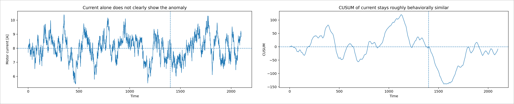
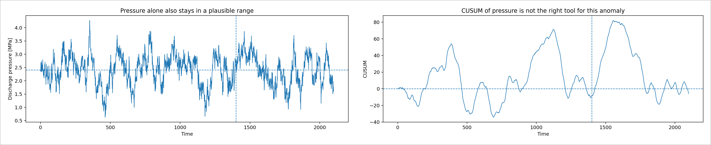
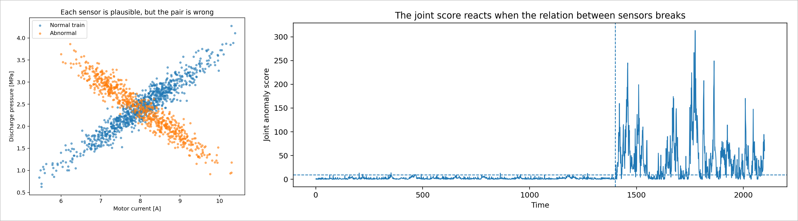

# 新入社員向け資料  
# CUSUM と異常スコアの違いを、現場のセンサ例で理解する

---

## 0. この資料の目的

この資料の目的は、次の 2 つを明確に理解することです。

1 つ目は、**CUSUM は何を見る道具なのか**。  
2 つ目は、**異常スコアはどんなときに必要になるのか**。

現場でデータを見るとき、次のような疑問がよく出ます。

- 生波形を見れば十分ではないか
- CUSUM があるなら、異常スコアは要らないのではないか
- 逆に、異常スコアがあるなら CUSUM は要らないのではないか

この資料では、**現実にありそうなセンサ例**を使って、それぞれの役割を整理します。  
読み終わったときに、明日から次の判断ができるようになることを目指します。

- 1 つのセンサには CUSUM をどう使うか
- 2 つ以上のセンサには異常スコアをどう使うか
- それらを日々の分析でどう組み合わせるか

---

## 1. まず結論

最初に結論だけ言います。

**CUSUM は、1 本の信号が時間方向に少しずつずれていないかを見る道具です。**

**異常スコアは、複数の信号の組み合わせが、いつもの関係から外れていないかを見る道具です。**

この 2 つは競合ではありません。  
見る方向が違います。

- CUSUM は **時間方向の変化**
- 異常スコアは **信号どうしの関係の変化**

を見ます。

そのため、

- **1 つのセンサの小さな継続ずれ**を見たいなら CUSUM が主役
- **複数センサの関係異常**を見たいなら異常スコアが主役

と考えると整理しやすいです。

---

## 2. 現場でよくある最初の問い

たとえば、包装機・ポンプ・コンプレッサ・搬送設備などを考えます。  
日々見ているデータは、次のようなものです。

- 吐出圧
- モータ電流
- 温度
- 流量
- 振動

現場では、こういう問いがよく出ます。

**この波形だけを見て、異常が始まっていると言えるか。**

ここで難しいのは、実測値には普通にノイズがあることです。  
運転条件のゆらぎもあります。  
そのため、少しずつ悪化していても、生波形だけでは「ただのゆらぎ」に見えることがあります。

---

## 3. 例1：1つのセンサなら CUSUM が効く

### 3.1 設定背景

まず、1 つのセンサだけを見る例です。  
設備の**吐出圧**を考えます。

現実の背景としては、次のような状況を想定します。

- 最初の長い区間は正常運転
- その後、吐出系の抵抗や制御ずれの影響で、圧力が**少しだけ高め**に出続ける
- ただしノイズやゆっくりした運転変動があるので、生波形だけでははっきり言いにくい

### 3.2 図で確認する

左が生波形、右が CUSUM です。

左を見ると、波形はかなり揺れています。  
これだけを見ると、「少し高めが続いている」と強くは言えません。

右の CUSUM を見ると、途中から上向きの傾きが続いています。  
これは、**平均より少し高い状態が継続している**ことを意味します。

### 3.3 CUSUM の基本式

CUSUM の最も基本の形は

$$
S_t = \sum_{i=1}^{t}(x_i - \mu)
$$

です。

ここで、

- $x_i$ は時刻 $i$ の測定値
- $\mu$ は基準平均
- $S_t$ は時刻 $t$ までの累積和

です。

この式で大事なのは、

$$
S_t - S_{t-1} = x_t - \mu
$$

という関係です。

つまり、**CUSUM の傾き = その時点の値が基準平均より上か下か** です。

- 値が平均より上なら、CUSUM は上がる
- 値が平均より下なら、CUSUM は下がる
- 値が平均付近なら、CUSUM は平らに近い

### 3.4 数値で直感をつかむ

たとえば、正常時の平均が

$$
\mu = 1.50
$$

だとします。

新しく入ってきたデータが

$$
1.51,\ 1.52,\ 1.49,\ 1.51,\ 1.52
$$

なら、平均との差は

$$
0.01,\ 0.02,\ -0.01,\ 0.01,\ 0.02
$$

です。

これを順に足すと、

$$
0.01,\ 0.03,\ 0.02,\ 0.03,\ 0.05
$$

となります。

生波形だけだと「全部 1.5 前後で普通」に見えます。  
でも、CUSUM ではじわじわ上向きになります。

これが CUSUM の一番大事な意味です。

**1点では小さいが、同じ向きのずれが続くと見えてくる。**

### 3.5 現場での言い換え

現場の言葉で言い換えると、CUSUM は

- 毎回ほんの少し高い
- 毎回ほんの少し低い
- ずっとわずかにずれている

という異常を見つけるための道具です。

NIST の資料でも、CUSUM は平均の小さなシフトの検出に効率がよく、とくに小さい平均ずれの検出に向くと説明されています。

---

## 4. 例2：継続誤差の例

同じ考え方を、もう少しはっきりした継続誤差の例で見ます。

### 4.1 設定背景

想定するのは、たとえば次のような状況です。

- センサの零点が少しずれた
- 制御のオフセットが少し変わった
- 配管条件の変化で、値がずっと少し高めに出るようになった

つまり、**一度ずれてから、その後ずっと少し高め** というケースです。

### 4.2 図で確認する

左の生波形だけでは、ノイズもあるので「継続誤差だ」と断言しにくいです。  
でも右の CUSUM は、正常区間のあとで長く上向きに積み上がっています。

このときの読み方は単純です。

- CUSUM が長く上向き → 平均より少し高い状態が続いている
- CUSUM が長く下向き → 平均より少し低い状態が続いている

このように、**1本のセンサの継続ずれ**は CUSUM が非常に分かりやすいです。

---

## 5. ここで次の疑問が出る

ここまで読むと、次の疑問が出ます。

**CUSUM で見られるなら、異常スコアなんて要らないのではないか。**

この疑問は、1 つのセンサだけを見るならかなりもっともです。  
実際、1 本の意味のあるセンサに対して、見たい異常が「小さな継続ずれ」なら、CUSUM だけで十分なことは多いです。

では、どんなときに異常スコアが要るのでしょうか。

答えは、

**複数センサの関係だけが壊れるとき**

です。

---

## 6. 例3：生波形や単独 CUSUM では気づきにくい関係異常

### 6.1 設定背景

ここでは、2 つのセンサを考えます。

- モータ電流 [A]
- 吐出圧 [MPa]

現場では、負荷が高くなれば電流も上がり、吐出圧も上がる、といった**自然な関係**があります。  
つまり、正常時には

**電流が高いときは圧力も高め**

という関係が成立しています。

今回の異常は、次のような状況を想定しています。

- 設備の負荷そのものは普通に変動している
- 電流だけ見ると普通に見える
- 圧力だけ見ても普通に見える
- しかし、**電流と圧力の関係だけが壊れている**

現実の例で言えば、

- 制御弁の動きがおかしい
- 圧力センサ系だけ補正が崩れた
- 配管系の状態が変わって、負荷と圧力の対応関係が崩れた

といったイメージです。

### 6.2 電流だけを見る

左の生波形を見ても、普通の運転変動に見えます。  
右の CUSUM を見ても、「明確な平均ずれ」とは言いにくいです。

### 6.3 圧力だけを見る

こちらも同じです。  
圧力単独で見れば、異常区間でも値の範囲はそれなりにもっともらしく見えます。  
CUSUM も、平均が大きくずれたわけではないので、決定打になりません。

### 6.4 2つの関係を見る

左の散布図を見ると、正常時の点群と異常時の点群は、**センサどうしの関係**が違います。  
各センサ単独では普通でも、組み合わせると「いつもの関係ではない」ことが分かります。

右のグラフは、この関係の崩れを 1 本のスコアにしたものです。  
このスコアは、正常学習区間で作った「いつもの 2 センサの雲」から、今の点がどれだけ離れているかを表しています。

この例では、

- 電流の平均差はほぼ 0
- 圧力の平均差もほぼ 0

なのに、

- 組み合わせ異常スコアは異常区間で強く反応

しています。

ここが重要です。

**各センサ単独では分からない。  
でも、2つを同時に見ると異常が分かる。**

これが異常スコアを出す理由です。

---

## 7. 異常スコアは何をしているのか

この資料では、異常スコアの中身を難しく説明しすぎないようにします。  
新入社員向けには、まず次の理解で十分です。

**異常スコア = 複数センサの組み合わせが、正常時の集まりからどれくらい離れているかを表す数**

今回の例では、平均ベクトル $\mu$ と共分散行列 $\Sigma$ を使った距離、つまり**マハラノビス距離の2乗**を使っています。

$$
d(x)^2 = (x - \mu)^T \Sigma^{-1} (x - \mu)
$$

ここで、$x$ は「今の2つのセンサ値」を縦に並べたベクトルです。  
今回の例なら、

$$
x =
\begin{bmatrix}
\text{電流} \\
\text{圧力}
\end{bmatrix}
$$

です。

$\mu$ は、正常学習区間の平均ベクトルです。  
つまり、正常時の「だいたいこのあたりに点が集まる」という中心です。

$$
\mu =
\begin{bmatrix}
\text{正常時の平均電流} \\
\text{正常時の平均圧力}
\end{bmatrix}
$$

$\Sigma$ は、正常学習区間の共分散行列です。  
これは、次の3つをまとめて持っています。

- 電流がどれくらいばらつくか
- 圧力がどれくらいばらつくか
- 電流と圧力がどれくらい一緒に動くか

### 7.1 なぜ普通の距離ではだめなのか

普通の距離は、平均点からの遠さしか見ません。  
でも現場のセンサは、**信号どうしの関係**が重要です。

今回の例では、正常時には

- 電流が高いと圧力も高め
- 電流が低いと圧力も低め

という関係があります。

このような場合、平均から少し離れていても、**正常時の関係に沿って動いているなら普通**です。  
逆に、平均からそこまで遠くなくても、**正常時の関係から外れていれば異常**です。

マハラノビス距離は、この「正常時のばらつき方」と「信号どうしの相関」を使って、

**正常な雲の中にいるか、雲の外にいるか**

を測る距離です。

### 7.2 散布図でどう読むか

図の左の散布図を思い出してください。  
正常時の点は、丸い雲ではなく、ある向きに細長く伸びた雲になっています。

これは、電流と圧力が無関係ではなく、**一緒に動く**からです。

このとき、

- 雲の長い向きに沿った変化は、多少大きくても「普通」
- 雲を横切る向きの変化は、小さくても「変」

になります。

マハラノビス距離は、この細長い雲の形を考慮して距離を測ります。  
だから、今回のように

- 電流単独では普通に見える
- 圧力単独でも普通に見える
- でも2つの関係はいつもと違う

という異常を拾いやすいです。

### 7.3 数値イメージで理解する

かなり単純化して考えます。  
正常時の中心が

$$
\mu =
\begin{bmatrix}
8.0 \\
2.4
\end{bmatrix}
$$

だとします。  
これは「電流は 8.0 A くらい、圧力は 2.4 MPa くらいが中心」という意味です。

ここで、

$$
x_1 =
\begin{bmatrix}
8.5 \\
2.7
\end{bmatrix}
$$

という点を考えます。  
平均からは少し離れていますが、電流が高いなら圧力も高い、という正常時の関係に沿っています。  
この点は、平均からの単純距離はやや大きくても、マハラノビス距離ではそこまで極端にならないことがあります。

一方で、

$$
x_2 =
\begin{bmatrix}
8.5 \\
2.1
\end{bmatrix}
$$

を考えます。  
電流は高いのに、圧力は低いです。  
これは各値だけ見ればありえそうでも、**組み合わせとしてはかなり不自然**です。

今回の異常スコアは、こういう点を大きく評価します。

### 7.4 実際の計算手順

業務では、異常スコアは次の順で作ります。

#### 手順1
正常だとみなせる期間のデータを集める。

#### 手順2
その期間の平均ベクトル $\mu$ を計算する。

$$
\mu = \frac{1}{N}\sum_{t=1}^{N} x_t
$$

#### 手順3
その期間の共分散行列 $\Sigma$ を計算する。

$$
\Sigma = \frac{1}{N-1}\sum_{t=1}^{N}(x_t-\mu)(x_t-\mu)^T
$$

#### 手順4
新しい時刻の点 $x$ に対して

$$
d(x)^2 = (x - \mu)^T \Sigma^{-1} (x - \mu)
$$

を計算する。

この値が小さければ正常の雲に近い、  
大きければ正常の雲から外れている、  
という意味です。

### 7.5 この資料で本当に覚えるべきこと

ただし、覚えるべき本質は式そのものではありません。

本質は、

- 1つのセンサだけなら CUSUM でよいことが多い
- 複数センサの関係異常を見たいなら、まず異常スコアにまとめる必要がある
- マハラノビス距離は、その「組み合わせとしての変さ」を数にする代表的な方法

ということです。

---

## 8. CUSUM と異常スコアの違いを一言で整理する

ここまでを一言でまとめると、こうなります。

### CUSUM
**1本の信号が、時間方向に少しずつずれていないかを見る。**

向いている例：

- 圧力がずっと少し高い
- 温度がずっと少し低い
- 流量がゆっくり上振れしている

### 異常スコア
**複数信号の組み合わせが、正常時の関係から外れていないかを見る。**

向いている例：

- 電流は普通、圧力も普通だが、電流と圧力の関係が変
- 温度は普通、振動も普通だが、その組み合わせが変
- 複数センサを同時に見たときだけ違和感がある

つまり、

- **CUSUM は時間方向**
- **異常スコアは空間方向**

を見ています。

---

## 9. 業務ではどう使い分けるか

ここが実務で一番重要です。

### 9.1 毎日見るべき基本画面

まず、日常監視では次の 3 つを見るのが基本です。

1 つ目は、生波形です。  
これは単発の飛びや瞬間異常を見るためです。

2 つ目は、CUSUM または EWMA です。  
これは 1 本の信号の継続ずれを見るためです。

3 つ目は、異常スコアです。  
これは複数センサの関係異常を見るためです。

### 9.2 実際の分析手順

実務の流れは、次の順が分かりやすいです。

#### 手順1
まず生波形を見る。  
大きい飛び、停止、欠測、露骨な異常がないか確認する。

#### 手順2
1 本ずつ意味のあるセンサに対して CUSUM を見る。  
圧力、流量、温度などについて、継続ずれがないかを確認する。

#### 手順3
複数センサの関係を見る異常スコアを計算する。  
電流と圧力、圧力と流量、温度と振動など、**一緒に見ると意味がある組み合わせ**に対して使う。

#### 手順4
異常スコアが上がったら、散布図や相関図を見て、どの関係が崩れているかを確認する。

#### 手順5
必要なら、異常スコア自体に CUSUM や EWMA をかける。  
つまり、

$$
\text{複数センサ} \rightarrow \text{異常スコア} \rightarrow \text{CUSUM}
$$

という流れです。

これは、

- 異常スコアで関係異常を 1 本にまとめる
- そのスコアの継続性を CUSUM で見る

という二段構えです。

### 9.3 どういうときにどちらを優先するか

#### CUSUM を優先する場面
- 監視したいセンサが 1 本で十分意味を持つ
- 見たい異常が平均の小さな継続ずれ
- 現場に説明しやすい仕組みが欲しい

#### 異常スコアを優先する場面
- 2 本以上のセンサの関係異常が本質
- 各センサ単独では異常と言い切れない
- 「組み合わせとして変」を見たい

---

## 10. 明日から実践するための最小ルール

最後に、業務で迷わないように最小ルールに落とします。

### ルール1
**まず 1 本のセンサには CUSUM を使う。**

とくに、圧力・温度・流量のような、単独で意味が通る量には有効です。

### ルール2
**2 本以上のセンサで異常を考えるなら、関係を見る異常スコアを作る。**

「電流だけでは普通」「圧力だけでも普通」でも、組み合わせはおかしいことがあります。

### ルール3
**異常スコアが上がったら、必ず散布図や組み合わせ図で確認する。**

スコアだけではなく、**どの関係が壊れたのか** を見ることが大切です。

### ルール4
**必要なら、異常スコアにも CUSUM をかける。**

一瞬だけの関係異常ではなく、継続している関係異常を見たいなら、この組み合わせが有効です。

---

## 11. 最後のまとめ

この資料で覚えてほしいことは 3 つです。

### 1つ目
**CUSUM は、1 本の信号の小さな継続ずれを見る道具。**

### 2つ目
**異常スコアは、複数信号の組み合わせ異常を見る道具。**

### 3つ目
**実務では、CUSUM と異常スコアを競わせるのではなく、役割分担して使う。**

最も実務的な形は、

- 単独センサには CUSUM
- 関係異常には異常スコア
- 必要なら異常スコアにも CUSUM

です。

これができれば、明日からの監視・分析で  
「何を 1 本の信号として見るか」  
「いつ異常スコアを作るべきか」  
を迷いにくくなります。

---

## 参考情報

この資料の考え方は、主に次の整理に基づいています。

- CUSUM は平均の小さなシフト検出に向く
- EWMA も小さな継続変化の検出に向く
- 複数変数を同時に見るときは、多変量の見方が必要
- Mahalanobis 距離は、平均と共分散を使って「正常な集まりからの距離」を測る

必要なら次の段階として、

- この資料をベースにした社内勉強会スライド
- Python での最小実装コード
- あなたの設備データに合わせた監視フロー

まで展開できます。